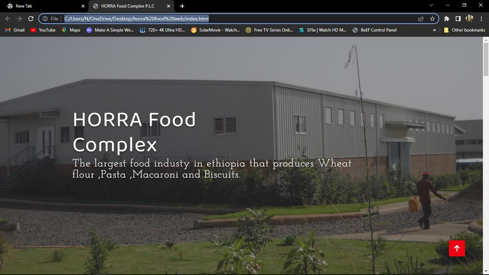

# horra
# Horra Foods Factory Website

This is the repository for the Horra Foods factory website, an online platform to showcase the company's flour, macaroni, pasta, and biscuit products, as well as facilitate communication with customers.

## Project Overview
The Horra Foods factory website serves as a digital showroom for the company's high-quality food products. The site aims to educate visitors about the manufacturing process, ingredients, and nutritional information, while also providing an avenue for customers to reach out with questions or inquiries.

Key features of the website include:

- Product pages with detailed descriptions, images, and nutritional facts for flour, macaroni, pasta, and biscuits
- Information about the Horra Foods manufacturing facility and commitment to quality
- Frequently Asked Questions (FAQ) section to address common customer queries
- Contact form for customers to reach the Horra Foods team directly
  ## Screenshots
  

## Technologies Used
- HTML
- CSS
- JavaScript
- PHP
## Contributing
Contributions are welcome! If you find any issues or have suggestions for improvements, please feel free to open a new issue or submit a pull request.

